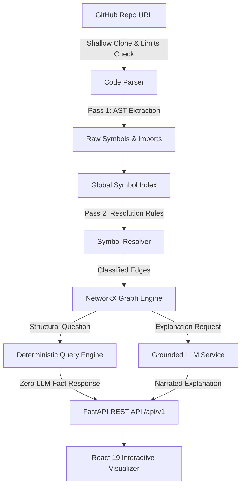

<div align="center">

# 🗺️ CodeAtlas

### Verified Architecture Explorer for Python Repositories

[](https://git.io/typing-svg)

[](https://github.com/Saisandeep05/CodeAtlas/actions)
[](LICENSE)
[](https://github.com/Saisandeep05/CodeAtlas/releases/tag/v1.0.0)
[](docs/TESTING.md)
[](#-quick-start)

</div>

---

## 💡 Pitch

**CodeAtlas** turns complex Python codebases into interactive, mathematically verified dependency and call graphs using deterministic Abstract Syntax Tree (AST) static analysis. Unlike typical repository chatbots that chunk code text into an LLM and let it guess structural relationships, CodeAtlas extracts line-level facts first—ensuring every import link, method call, and inheritance boundary is proven before an LLM ever narrates it.

---

## 🖼️ Interface Preview

<!-- TODO: record and embed a real ~15-20s GIF here showing:
     paste a GitHub URL -> analysis runs -> graph renders ->
     click a node -> ask a structural question (instant GRAPH ANSWER) ->
     ask an open-ended question (LLM EXPLANATION, GRAPH GROUNDED) ->
     open Impact Analysis for that node -->


---

## 📋 Table of Contents

- [Why CodeAtlas](#-why-codeatlas)
- [Key Features](#-key-features)
- [Architecture & Data Pipeline](#-architecture--data-pipeline)
- [Quick Start](#-quick-start)
- [API Usage Examples](#-api-usage-examples)
- [Testing & Quality Verification](#-testing--quality-verification)
- [Real-World Validation](#-real-world-validation)
- [Known Limitations](#-known-limitations)
- [Future Roadmap](#-future-roadmap)
- [License](#-license)

---

## ⚡ Why CodeAtlas

Most repository assistant tools rely entirely on Retrieval-Augmented Generation (RAG) over raw code chunks. When asked *"What components call function X?"*, an LLM guesses relationships based on text similarity, often producing plausible-sounding but incorrect structural assertions.

| Architectural Dimension | Typical RAG Repo Chatbot | CodeAtlas Deterministic Parser |
| :--- | :--- | :--- |
| **Relationship Extraction** | LLM guesses from text chunks | Deterministic Python AST parsing |
| **Structural Answers** | Probabilistic (prone to hallucination) | 100% verified graph traversal (Zero LLM calls) |
| **Relationship Evidence** | Vague text snippets | Exact file path, line number, & source expression |
| **Inheritance & Imports** | Inferred from context | Two-pass symbol index & resolution engine |
| **Impact Analysis** | Cannot calculate distance | Transitive graph reachability & shortest paths |

---

## ✨ Key Features

1. **Deterministic AST Static Analysis**: Parses Python codebases into exact syntax trees without executing any code.
2. **Two-Pass Symbol Resolver**: Classifies every structural edge into four strict certainty statuses:
   - `VERIFIED`: Proven by static AST analysis with line-level evidence.
   - `EXTERNAL`: References standard library or third-party packages.
   - `UNRESOLVED`: Statically indeterminate reference.
   - `AMBIGUOUS`: Multiple symbol candidates match without disambiguating scope.
3. **Zero-LLM Structural Q&A**: Questions inquiring about structural reachability (*"What calls function X?"*, *"What inherits from BaseClass?"*) bypass the LLM entirely and return 100% verified graph data in milliseconds.
4. **Grounded LLM Explanations**: When conceptual explanations are requested, the prompt is strictly bound to verified graph edges, resisting prompt injection hijacking.
5. **Transitive Impact Analysis**: Evaluates *"What breaks if I change node X?"* via backend API `/api/v1/repo/{id}/impact/{node_id}` by computing NetworkX transitive ancestors and shortest distance paths.
6. **Interactive Visual Explorer**: Built with React 19 and Cytoscape.js canvas featuring neighborhood highlighting, graph mode filtering (`FILES`, `CLASSES`, `FUNCTIONS`, `FULL`), and 1-click sample repo loading (`flask`, `requests`, `fastapi`).

---

## 🏛️ Architecture & Data Pipeline



---

## 🚀 Quick Start

### 1. Local Development Setup

#### Prerequisites
- Python 3.10+
- Node.js 18+
- Git

#### Backend Setup
```bash
# Navigate to backend directory
cd backend

# Copy environment configuration
cp .env.example .env

# Install dependencies (fastapi>=0.141.1, uvicorn>=0.52.4, networkx>=3.6.1, google-genai>=2.19.0)
pip install -r requirements.txt

# Start FastAPI development server
uvicorn app.main:app --reload --port 8000
```
API endpoints will run at `http://localhost:8000`. Interactive OpenAPI documentation is accessible at `http://localhost:8000/docs`.

#### Frontend Setup
```bash
# Navigate to frontend directory
cd frontend

# Install Node dependencies
npm install

# Start Vite development server
npm run dev
```
Access the web explorer interface at `http://localhost:5173`.

---

### 2. Single-Command Docker Deployment

```bash
# Copy environment configuration
cp .env.example .env

# Build and launch multi-container stack
docker compose up --build
```
Access the application at `http://localhost:5173`.

---

## 📡 API Usage Examples

### 1. Analyze Repository (`POST /api/v1/analyze`)
```bash
curl -X POST "http://localhost:8000/api/v1/analyze" \
     -H "Content-Type: application/json" \
     -d '{"repository_url": "https://github.com/pallets/flask"}'
```
**Sample Response (Abbreviated):**
```json
{
  "repository_name": "flask",
  "commit_hash": "d318b68",
  "status": "COMPLETED",
  "statistics": {
    "total_python_files": 83,
    "total_classes": 160,
    "total_functions": 1462,
    "total_relationships": 5087,
    "verified_count": 1826,
    "external_count": 1446,
    "unresolved_count": 1805,
    "ambiguous_count": 10,
    "verified_precision_percentage": 50.3
  }
}
```

### 2. Transitive Impact Analysis (`GET /api/v1/repo/{repo_id}/impact/{node_id}`)
```bash
curl -X GET "http://localhost:8000/api/v1/repo/flask_d318b68/impact/function:src/flask/app.py:Flask.dispatch_request"
```
**Sample Response:**
```json
{
  "target_node": "function:src/flask/app.py:Flask.dispatch_request",
  "affected_caller_count": 14,
  "impacted_nodes": [
    {
      "id": "function:src/flask/app.py:Flask.full_dispatch_request",
      "distance": 1,
      "relationship_type": "CALLS"
    }
  ]
}
```

---

## 🧪 Testing & Quality Verification

CodeAtlas maintains a zero-trust automated test suite covering unit invariants, API integrations, and security boundary conditions:

```bash
cd backend
python -m pytest -v
```

### Test Suite Summary
- **Total Tests**: **62 Passed** (0 failed, 0 skipped)
- **Execution Time**: ~2.48s
- **Breakdown**:
  - **Unit Tests (35)**: Dataclass domain models, symbol indexing, 15 resolver edge cases (aliases, super calls, decorators, `@staticmethod`, diamond inheritance, `if TYPE_CHECKING:` guards), NetworkX graph engine.
  - **Integration Tests (18)**: REST API flow (`/api/v1`), database cache hit/invalidation, rate limiter middleware, OpenAPI specification rendering.
  - **Security & Limits Tests (9)**: URL safety regex validation, shallow clone limits, prompt injection data isolation, temporary workspace cleanup.

---

## 📊 Real-World Validation

Benchmarked against leading open-source Python repositories (detailed evaluation logs in [`docs/REAL_WORLD_VALIDATION.md`](docs/REAL_WORLD_VALIDATION.md)):

### Benchmark Repositories & Relationship Breakdown

| Target Repository | Scope Definition | Files Analyzed | VERIFIED | EXTERNAL | UNRESOLVED | AMBIGUOUS | Total Edges | Resolution Precision (Verified / (Verified + Unresolved)) |
| :--- | :--- | :---: | :---: | :---: | :---: | :---: | :---: | :---: |
| `psf/requests` | Core Package (`src/requests/`) | 19 | 723 | 414 | 392 | 0 | 1,529 | **64.8%** |
| `psf/requests` | Full Repository (Archive) | 37 | 1,426 | 1,218 | 967 | 3 | 3,614 | **59.6%** |
| `pallets/flask` | Core Package (`src/flask/`) | 24 | 754 | 455 | 564 | 4 | 1,777 | **57.2%** |
| `pallets/flask` | Full Repository (Archive) | 83 | 1,826 | 1,446 | 1,805 | 10 | 5,087 | **50.3%** |
| Simulated App (`core/`) | Multi-module test fixture | 4 | 18 | 3 | 1 | 0 | 22 | **94.7%** |

### Performance Timings

| Pipeline Stage | `psf/requests` (37 files) | `pallets/flask` (83 files) |
| :--- | :---: | :---: |
| **Fetch / Shallow Clone (`main.zip`)** | 2.632 s | 2.973 s |
| **AST Parse & Fact Extraction (Pass 1)** | 0.702 s | 1.480 s |
| **Symbol Index & Resolution (Pass 2)** | 0.019 s | 0.029 s |
| **NetworkX Graph Build & Validation Pass** | 0.047 s | 0.070 s |
| **Total End-to-End Pipeline Time (`POST /api/v1/analyze`)** | **3.400 s** | **3.640 s** |
| **Cached Re-query Response Time** | **0.012 s** | **0.015 s** |

---

## ⚠️ Known Limitations

1. **Language Scope**: Current parser strictly targets Python codebases (`.py`). Multi-language AST parsing (TypeScript, Go) is planned.
2. **Dynamic Metaprogramming**: Statically indeterminate runtime expressions (e.g. `getattr(obj, var)()`, `eval()`, `exec()`) cannot be resolved without code execution and are classified as `UNRESOLVED`.
3. **Single LLM Provider**: Explanation pipeline connects to a single configured provider (Google Gemini 2.5 Flash) per instance session.

---

## 🗺️ Future Roadmap

Pulled from our architectural audit ([`docs/PORTFOLIO_AUDIT.md`](docs/PORTFOLIO_AUDIT.md)):

- [x] **Transitive Impact Analysis Engine**: Transitive caller depth and shortest path calculation available via `/api/v1/repo/{id}/impact/{node_id}`.
- [ ] **Hosted Live Demo**: Deploy public frontend on Vercel and backend container on Render/Fly.io.
- [ ] **Frontend Testing Suite**: Add Vitest + React Testing Library component tests.
- [ ] **Large Graph Visual Clustering**: Implement Louvain community collapsing & Degree-Centrality filtering for 1,000+ node codebases.
- [ ] **Multi-Language AST Parsers**: Extend two-pass symbol resolution to TypeScript and Go using Tree-sitter.

---

## 📄 License

Distributed under the MIT License. See [`LICENSE`](LICENSE) for complete terms.
